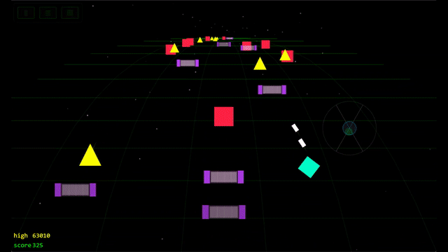

# BEATRIDER

Lane-based rhythm shooter with procedural techno. Built with AI, refactored by AI.



**Play:** https://thebeatrider.com/play/

**Devlog:** https://thebeatrider.com/devlog/

## What this was

8,360 lines in a single HTML file. No build process, no modules, no IDE navigation -- just Ctrl+F and vibes. Built in a week with Claude, shipped to GitHub Pages, and it worked. Read the origin story: [Arguing Software Into Existence](https://thebeatrider.com/devlog/arguing-software-into-existence.html)

## What this is now

12 ES modules, a Vite build, and npm packages. Same game, proper structure. Three AI agents decomposed the monolith in parallel -- one extracted the 5,000-line gameplay scene, one fixed the audio module exports, one built the new entry point. About an hour total. Read the refactoring story: [Refactoring the Monolith](https://thebeatrider.com/devlog/refactoring-the-monolith.html)

## Quick start

```bash
cd play
npm install
npm run dev
```

Or serve the original monolith with any static server: `python3 serve.py`

## Controls

**Desktop:** Arrow keys to move, Space to fire, W to jump

**Mobile:** Swipe to move, Tap to fire, Swipe up to jump

## Features

- Procedural melodic techno generated in real-time
- Enemies spawn to the beat -- different drums trigger different enemy types
- 5 lanes, combo system, power-ups
- Multiple genres: Detroit techno, Berlin minimal, Chicago acid, D&B, tropical
- Works offline (PWA)

## Tech

- [Phaser.js](https://phaser.io/) for the game engine
- [Tone.js](https://tonejs.github.io/) for audio synthesis
- [Vite](https://vite.dev/) for bundling
- Built and refactored with [Claude](https://claude.ai)

## License

MIT - See [LICENSE](LICENSE) file

---

*A vibe coding project*